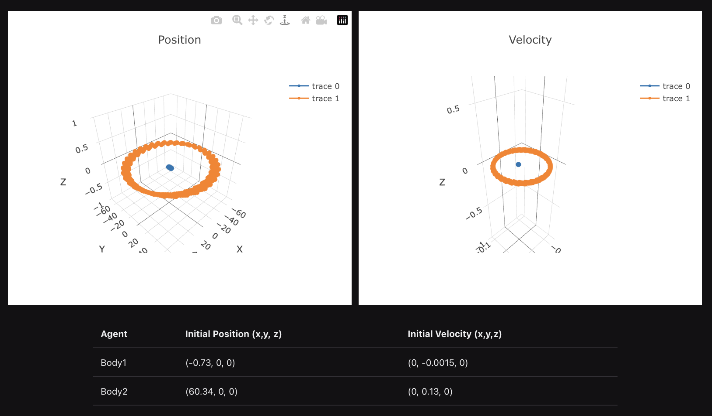

# Sedaro Nano
The tiniest possible mockup of our system

## Goal
The goal of this mini-project is to gain a better understanding of your ability to **be creative**, **think through problems**, and **solve relevant challenges** related to the engineering roles at Sedaro. This is an opportunity for you to show off your personal strengths. Don't focus on the simple contributions and instead aim to really impress us.

Submissions are evaluated on whether they are job-relevant, meet the title level, make the product better, keep a high quality bar, and are clearly and concisely explained in the write-up. The project is due within **7 days** of receipt and we expect you to spend no more than **6 hours** on it. If you have any questions, issues, or if you get stuck, please contact Kacie at `kacie.neurohr@sedaro.com`.

## Submission
Please submit a `.zip` file including:
- The **code** (excluding temporary or .gitignored files and directories, such as `__pycache__`, `node_modules`, `target`, or any local virtual environments)
- **Instructions** for setting up and running your solution
- **Screenshots or a video** of your solution in action
- A **write-up** explaining your changes and why you made them

If you end up getting to a solution that you aren't happy with or that is a dead end, document why and we will call that good enough. A write-up of why a solution is insufficient and how you might approach it differently often tells us what we need to know.

Once you have completed your solution, email it to `kacie.neurohr@sedaro.com` and the other email(s) listed in the original instructions. To avoid your submission being blocked by our mail server, we recommend sharing the `.zip` file using a Google Drive link (or similar sharing service).

## Choosing a Project
Included in this directory is a tiny mockup of Sedaro's system. Though it technically comprises a full-stack app, there are _many_ areas in which it could be improved. Review the files that make up Sedaro Nano to figure out how it works, then choose a project that shows off your unique strengths. The prompt is intentionally open-ended to allow creative solutions.

Here are some suggestions to get you thinking:

#### Frontend/full-stack
- Revamp the UI/UX with cool visualizations and interactivity
- Live-stream the simulation
- Show off your best creative work with a redesign

#### Backend
- Add unique patterns of user engagement
- Create a more scalable storage solution than a JSON string in one DB row
- Do some statistical analysis on the data
- Set up background jobs to preprocess data
- Incorporate computational optimizations (e.g. linear programming)

#### DevOps
- Improve observability

#### Modeling & Simulation
- Improve the numerical stability of the simulation functions
- Implement additional modeling and simulation scope
- Analyze the sensitivity to initial conditions

#### Compiler & Runtime
- Speed up either buildtime or runtime
- "Compile" the query language which is currently interpreted
- Make simulations deterministic
- Parallelize simulation execution
- Expand the query language
- Expand the simulation semantics beyond simple pure functions
- Improve the Q-Range KV Store data structure



## Setup
1. Clone this repository.
   - Please note that **only** cloning via HTTPS is supported
   - Please **do not** commit changes to any branch of this repository. If you would like to use git, you may fork this repository to create a private repo of your own
2. Ensure that Docker is installed and running. To compile and run the app, execute the following command
   - `docker compose up --build`
   - Ensure your localhost ports `3030` and `8000` are available first.
3. That's it ✅! Sedaro Nano should now be available via web browser at http://localhost:3030/. The API is running at http://localhost:8000/.
   - It may take a few moments for the container to fully come up and serve the page.
   - Changes to both the React app and the Flask app should auto reload.

### Directory Structure
```sh
.
├── README.md                 # This README
├── app                       # The backend (Python)
│   ├── app.py                # Setup + API handling
│   ├── modsim.py             # Modeling and simulation functions
│   ├── simulator.py          # Core simulation runtime
│   └── store.py              # In-memory stream data structure
├── queries                   # Query-parsing library (Rust)
│   └── src
│       ├── grammar.lalrpop   # The syntax definition
│       ├── lib.rs            # The parser library
│       └── main.rs           # A binary for using the parser
└── web                       # The frontend (React/TypeScript)
    └── src
        ├── App.tsx           # View simulation results
        └── SimulateForm.tsx  # Define a simulation
```

### Tips
- You may wish to search for `NOTE:` in the code to get situated.
- The Python and React code will auto-reload when edited, but Rust changes require manual rebuilds.
- It's possible to work on parts of this repo outside of the docker containers for more rapid development.

### Tutorial
In the initial version, the first body is not affected by the gravitational force of the second. See `app/query_tutorial.md` for guidance on fixing this, and a brief introduction to the nano query language.
